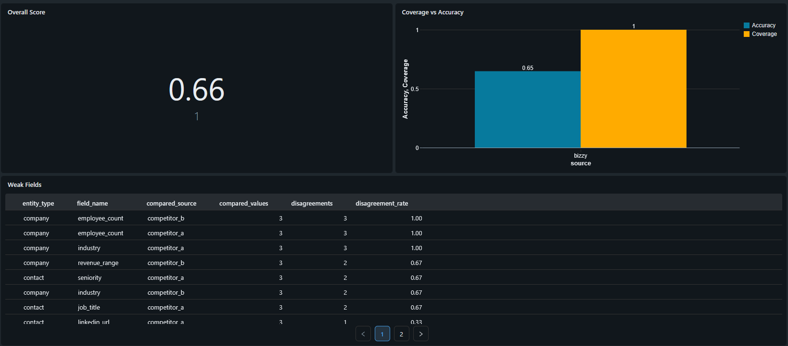

# Bizzy Data Quality Bake-off

## Overview

This is a modular Python implementation of a **data quality bake-off** designed to compare Bizzy data against competitor sources.

The solution is intentionally simple. It's built and tested to run inside **Databricks**, where it can be scheduled and visualized through dashboards.

---

## Running the Project

### Minimum setup (Databricks)

1. Import this repository into **Databricks Repos**
2. Upload sample data to a volume, for example:
``
/Volumes/bizzy_bakeoff/input/input_files/sample_companies.csv
/Volumes/bizzy_bakeoff/input/input_files/sample_contacts.csv
``

3. Create output schema
```sql
CREATE CATALOG IF NOT EXISTS bizzy_bakeoff;
CREATE SCHEMA IF NOT EXISTS bizzy_bakeoff.gold;
```

4. Open the notebook:
```
notebooks/01_run_bakeoff.py
```

5. Add source path:
```python
import sys
sys.path.insert(0, "../src")
```

6. Run:
```python
from bakeoff.config import BakeoffConfig
from bakeoff.runner import run_bakeoff

config = BakeoffConfig(
    companies_path="/Volumes/bizzy_bakeoff/input/input_files/sample_companies.csv",
    contacts_path="/Volumes/bizzy_bakeoff/input/input_files/sample_contacts.csv",
    output_mode="delta",
    catalog="bizzy_bakeoff",
    schema="gold",
)

run_bakeoff(config)
```

### Output
The pipeline writes 3 delta tables:
```
bizzy_bakeoff.gold.field_comparisons
bizzy_bakeoff.gold.entity_scores
bizzy_bakeoff.gold.executive_summary
```

---
## Design
### Architecture
```
src/bakeoff/
  connectors/       # competitor data sources
  normalization/    # standardization logic
  comparison/       # field-level comparison + scoring
  storage/          # CSV + Delta writers
  runner.py         # pipeline orchestration
  ```

### Pipeline
```
Ingestion -> Normalization -> Comparison -> Scoring -> Output
```
---

## Dashboard
A simple dashboard is built in Databricks SQL using the Delta tables.

It includes:
- Overall quality score
- Field-level disagreement
- Accuracy v. Coverage score breakdown



---

## Scheduling
The notebook can be scheduled using Databricks Workflows.

For a more production grade solution, we can use a YAML with Databricks Asset Bundles

Example (conceptual):
```yaml
schedule:
  quartz_cron_expression: "0 0 9 */14 * ?"
```
This should run the bake-off every two weeks with no manual intervention.

---

## Assumptions

For this prototype:

- Bizzy sample data is treated as the baseline
- Competitor data is mocked
- Sample size is limited (5 companies / 5 contacts)
- Comparison is exact match based (no fuzzy matching)
- Scoring weights are fixed and simplified
---

## Limitations

- No external ground truth validation
- Agreement is used as a proxy for correctness
- Small sample size: not statistically representative
- Freshness is not fully evaluated (missing timestamps)
- All fields are treated equally in scoring
---

## Production Consideration

To make this production-grade:

- Add truth resolution layer (multi-source validation)
- Use real competitor APIs
- Increase sample size and use stratified sampling
- Add fuzzy / semantic matching
- Introduce field-level weighting
- Package as a Python wheel
- Deploy via Databricks Jobs / Asset Bundles
- Add monitoring and alerts
---

## Summary

This implementation provides:

- Simple, modular pipeline
- Repeatable bake-off test
- Databricks-ready execution model
- Simple dashboard